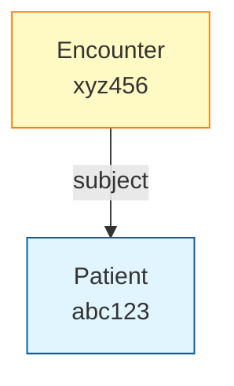
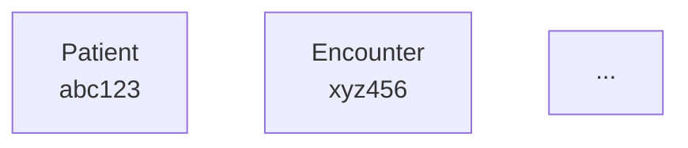

# Fix: Graph and Download Button Not Showing

## Problem
The graph visualization and download button weren't appearing in the frontend even though the backend was generating them.

## Root Causes

1. **AI was modifying the content**: The `streamText` with `gpt-4o-mini` was reprocessing the response and stripping out mermaid code blocks and HTML elements
2. **HTML not rendered**: React-markdown doesn't allow HTML by default for security
3. **System prompt not strict enough**: The AI wasn't preserving the exact formatting

## Solutions Applied

### 1. Updated API Route (`app/api/agents/opencompute/route.ts`)

**Changed:**
- Added HTML download button with inline styles
- Used very strict system prompt telling AI to output EXACTLY as provided
- Fixed stats typo (was using `total_resources` twice)

**Before:**
```typescript
return streamText({
  model: openai.chat('gpt-4o-mini'),
  system: 'You are a helpful assistant...',
  prompt: `Present this FHIR generation result...`
})
```

**After:**
```typescript
return streamText({
  model: openai.chat('gpt-4o-mini'),
  system: `You MUST output the following content EXACTLY as provided, with NO modifications...`,
  prompt: enhancedResponse
})
```

### 2. Added HTML Support to Markdown (`components/message.tsx`)

**Added:**
- Import for `rehype-raw`
- Added `rehypeRaw` to plugins list

This allows the HTML download button to render properly.

### 3. Installed Dependencies

```bash
npm install rehype-raw --legacy-peer-deps
```

## What You'll See Now

### 1. Mermaid Graph


### 2. Download Button
A styled blue button that downloads the FHIR Bundle JSON file.

```html
<a href="data:application/json..." download="fhir-bundle-patient-123.json">
  📥 Download FHIR Bundle JSON
</a>
```

## Testing Steps

### 1. Restart Frontend

```bash
cd /Users/bkyritz/Code/Jori/open-compute-website
npm run dev
```

### 2. Make a New Request

**Important**: You need to make a NEW request, not just refresh the old page. The old page has already cached the response without the graph.

1. Go to http://localhost:3000
2. Enter a patient journey:
   ```
   A 58-year-old male named John Doe presented to the ER with chest pain. 
   His blood pressure was 150/95 mmHg. He was diagnosed with acute myocardial 
   infarction and given aspirin 325mg and nitroglycerin.
   ```
3. Submit

### 3. Verify Results

You should see:
- ✅ Text summary
- ✅ **Mermaid graph** showing relationships
- ✅ **Blue download button** at the bottom
- ✅ Clicking button downloads `fhir-bundle-patient-xxx.json`

## Troubleshooting

### Graph Still Not Showing

**Check:**
1. Are you looking at a NEW request? Old requests won't have the graph.
2. Open browser console - any errors?
3. Check if mermaid is loaded:
   ```javascript
   // In browser console
   typeof mermaid
   ```

### Download Button Not Working

**Check:**
1. Does the button appear but not download?
   - Try right-click "Save Link As..."
2. Is the button styled (blue background)?
   - If yes: HTML is rendering ✓
   - If no: HTML might be escaped

### Backend Not Returning Graph

**Check backend response:**
```bash
curl -X POST http://localhost:8000/opencompute/generate-fhir-from-patient-journey \
  -H "Content-Type: application/json" \
  -d '{"patient_id":"test","summary":"Test","stages":[{"name":"Visit","description":"Test"}]}' \
  | jq '.graph_data'
```

Should return graph data with nodes, edges, and mermaid diagram.

## Files Changed

1. **`open-compute-website/app/api/agents/opencompute/route.ts`**
   - Stricter system prompt
   - HTML download button
   - Fixed stats display

2. **`open-compute-website/components/message.tsx`**
   - Added `rehype-raw` import
   - Added to plugins list

3. **`open-compute-website/package.json`** (via npm install)
   - Added `rehype-raw` dependency

## Why This Works

### Content Preservation
The strict system prompt ensures the AI outputs the content exactly as provided:
```
You MUST output the following content EXACTLY as provided, 
with NO modifications, NO explanations, NO additions, 
and NO formatting changes.
```

### HTML Rendering
`rehype-raw` allows safe HTML rendering in markdown, so the styled download button appears correctly.

### Mermaid Rendering
The CodeBlock component (already updated) detects `language === 'mermaid'` and renders it as an SVG diagram.

## Expected Output Format

```markdown
# Patient Journey to FHIR Generation Results

## Patient Information
- **Patient ID**: patient-123
- **Summary**: 58 year old male with chest pain

## Generation Status
- **Success**: ✅ Yes
- **Resources Generated**: 6

## Generated FHIR Resources
...

## 📊 Resource Relationship Graph

The generated FHIR resources have 6 resources with 6 relationships.



## 💾 Download FHIR Bundle

Download the complete FHIR Bundle as JSON:

<a href="data:application/json;charset=utf-8;base64,..." download="fhir-bundle-patient-123.json" style="display: inline-block; padding: 10px 20px; background-color: #3b82f6; color: white; text-decoration: none; border-radius: 6px; font-weight: 500;">📥 Download FHIR Bundle JSON</a>
```

## Next Steps

1. **Restart frontend**: `npm run dev`
2. **Make NEW request**: Don't reuse old chat
3. **Verify graph and button appear**
4. **Test download functionality**

If everything works, you should see beautiful visualizations and easy downloads! 🎉

