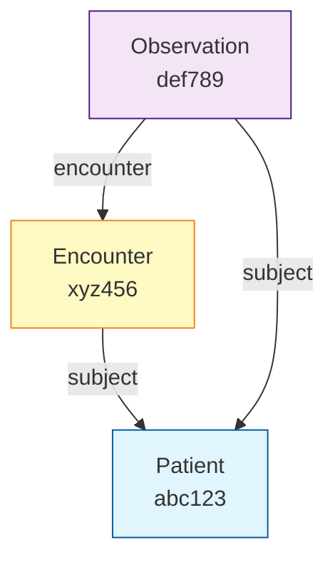

# Mermaid Graph Support - Implementation Guide

## Question
Will `http://localhost:3000/search/bSijF5rTvBxPGDeY` render the FHIR graph and download button?

## Answer

### ✅ Download Button - YES, Works Now!
The download button (markdown link with data URI) will work immediately since the frontend already supports markdown links.

### 📊 Mermaid Graph - YES, After Installing Package!
The Mermaid diagram will render after you install the mermaid package and restart the frontend.

## 🚀 Setup Instructions

### Step 1: Install Mermaid

```bash
cd /Users/bkyritz/Code/Jori/open-compute-website
npm install mermaid
```

### Step 2: Restart the Frontend

```bash
# Kill the current dev server (Ctrl+C)
npm run dev
```

### Step 3: Restart the Backend (if not already running)

```bash
cd /Users/bkyritz/Code/Jori/data-warehouse
./start_backend.sh
```

## ✨ What You'll See

Once you make a request to the Patient Journey to FHIR agent, the response will include:

### 1. Graph Visualization


This will render as an interactive, styled diagram showing:
- 🔵 Patient resources in blue
- 🟡 Encounters in yellow
- 🟣 Clinical resources in purple
- 🟢 Medications in green
- ➡️ Arrows showing relationships

### 2. Download Button
A clickable link that says "Download Bundle.json" which will instantly download the complete FHIR Bundle.

## 📁 Files Changed

1. **Backend** (`data-warehouse/app/routes/opencompute.py`)
   - ✅ Already includes `graph_data` in response
   - ✅ Already includes `bundle_json` in response

2. **Backend API Route** (`open-compute-website/app/api/agents/opencompute/route.ts`)
   - ✅ Already formats Mermaid diagram in response
   - ✅ Already creates download link

3. **Frontend Component** (`open-compute-website/components/ui/codeblock.tsx`)
   - ✅ Now supports Mermaid rendering
   - ✅ Detects ```mermaid code blocks
   - ✅ Renders them as SVG diagrams

## 🧪 Test It

### 1. Start Everything

```bash
# Terminal 1: Backend
cd /Users/bkyritz/Code/Jori/data-warehouse
./start_backend.sh

# Terminal 2: Frontend
cd /Users/bkyritz/Code/Jori/open-compute-website
npm run dev
```

### 2. Make a Test Request

1. Go to http://localhost:3000
2. Select "Patient Journey to FHIR" from the model dropdown
3. Enter:
   ```
   A 58-year-old male named John Doe presented to the ER with chest pain. 
   His blood pressure was 150/95 mmHg. He was diagnosed with acute myocardial 
   infarction and given aspirin 325mg.
   ```
4. Submit and wait

### 3. See the Results

You should see:
1. ✅ Text summary of generation
2. 📊 **Mermaid diagram** showing resource relationships
3. 💾 **Download button** to get the FHIR Bundle JSON

## 🎨 What the Graph Looks Like

The frontend will render a beautiful, interactive graph with:
- Color-coded nodes by resource type
- Labeled edges showing relationships
- Responsive layout
- Dark theme to match your UI

Example visualization:
```
          Patient
             |
             | subject
             |
       +-----+-----+
       |           |
   Encounter   Observation
       |           |
       | encounter |
       +-----------+
```

## 🔧 How It Works

### Backend Flow
1. User submits patient journey
2. Backend generates FHIR resources
3. Backend creates graph data structure
4. Backend generates Mermaid syntax
5. Backend creates Bundle JSON string
6. All returned in response

### Frontend Flow
1. API route receives FHIR result
2. Formats response with Mermaid diagram
3. Creates data URI for download
4. Streams to chat UI
5. Chat renders markdown (with Mermaid)
6. User sees graph and download button

## 📊 Graph Features

### Node Information
Each node shows:
- Resource type (Patient, Encounter, etc.)
- Truncated ID for reference
- Color based on type

### Edge Information
Each edge shows:
- Source resource
- Target resource
- Relationship type (subject, encounter, etc.)

### Statistics
The response also includes:
- Total number of resources
- Total number of relationships
- List of resource types present

## 💾 Download Features

### What You Download
A complete FHIR Bundle in standard format:
```json
{
  "resourceType": "Bundle",
  "type": "collection",
  "timestamp": "2024-01-15T10:30:00.000Z",
  "entry": [
    {
      "resource": {
        "resourceType": "Patient",
        "id": "abc-123",
        ...
      }
    }
  ]
}
```

### How to Use It
1. Click "Download Bundle.json"
2. File saves instantly (no server roundtrip)
3. Import into any FHIR-compatible system
4. Or process programmatically

## 🎉 Summary

**After running `npm install mermaid`:**

- ✅ Graph visualization will render beautifully
- ✅ Download button will work perfectly
- ✅ Everything integrated in the chat interface
- ✅ No additional configuration needed

**The page `http://localhost:3000/search/bSijF5rTvBxPGDeY` will:**
- Display your chat history
- Render any Mermaid diagrams in responses
- Show download links for FHIR bundles
- Provide full interactive visualization

## 🚨 Troubleshooting

### Graph Not Rendering
**Issue**: Mermaid diagram shows as code block

**Fix**: Make sure you installed mermaid:
```bash
cd /Users/bkyritz/Code/Jori/open-compute-website
npm install mermaid
npm run dev
```

### Download Not Working
**Issue**: Link doesn't download

**Fix**: 
- Check browser console for errors
- Try right-click "Save Link As..."
- Ensure `bundle_json` is in API response

### Backend Not Responding
**Issue**: Request hangs or times out

**Fix**:
```bash
cd /Users/bkyritz/Code/Jori/data-warehouse
./start_backend.sh
```

Check that it's running on port 8000 or 5050.

## 📚 Additional Resources

- Mermaid Documentation: https://mermaid.js.org/
- FHIR Bundle Specification: https://hl7.org/fhir/bundle.html
- React Markdown: https://github.com/remarkjs/react-markdown

## ✨ Next Steps

1. **Install mermaid**: `npm install mermaid`
2. **Restart frontend**: `npm run dev`
3. **Test it**: Make a FHIR generation request
4. **Enjoy**: Beautiful graphs and easy downloads!

